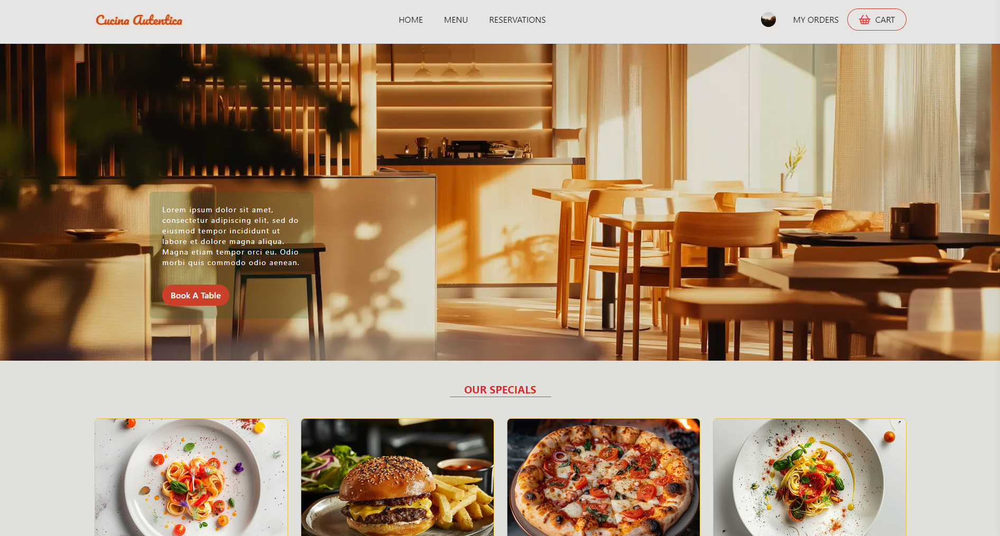

[](https://food-ordering-ten.vercel.app)

## Food Ordering App using Next.js, Clerk Auth and Prisma

### Deployed on VERCEL : [Visit Cucina Autentica](https://food-ordering-ten.vercel.app)

## 1. Overview

This application serves as a comprehensive digital platform for restaurant operations, facilitating a seamless interaction between customers and kitchen or service staff. It provides functionalities for menu browsing, order placement, and table reservations directly through the web interface.

### Features

User Authentication: Secure login through Clerk with support for Google, Github, and email-based authentication.
Real-Time Menu: Customers can view and order from a dynamically updated menu.
Order Management: Kitchen staff can review and update the status of orders in real-time.
Table Reservations: Allows staff to manage and reserve tables.
Role-Based Access: Different app sections are accessible based on user roles like Admin, Chef, and Waiter.
A default Role has been set for new users as WAITER to provide access to restricted links.

### Mockup



## 2. Getting Started

To get a local copy up and running follow these simple steps.

### a. Prerequisites

-   Node.js
-   Docker / Vercel account (for setting up a development/production PostgreSQL database)
-   A Clerk account (for authentication)

### b. Installation

-   Clone the repo

    ```
    git clone https://github.com/georgeboholteanu/food-ordering.git
    ```

-   Navigate to the project directory:

    ```
    cd food-ordering-app
    ```

-   Install NPM packages:

    ```
    npm install
    ```

-   Set up environment variables

    Create a .env.local file and populate it with the necessary Clerk and production/development variables.
    Create a .env file to populate with Postgres database variables

### c. Running the app

-   Start Docker for PostgreSQL:

    ```
    docker-compose up -d
    ```

-   Launch Prisma Studio to view the database:

    ```
    npx prisma studio
    ```

-   Run the development server:

    ```
    npm run dev
    ```

## Architecture

-   Frontend: Next.js and TypeScript, styled with Tailwind CSS, ShadCN and Lucide React.
-   Backend: Next.js API routes connecting to a Prisma ORM-managed PostgreSQL database.
-   Authentication: Managed by Clerk.
-   Deployment: The app is using Docker for accessing a developement database and is deployed on Vercel for production.

## User Personas

Restaurant Owner/Admin: Monitor restaurant operations and manage staff roles.

Wait Staff: Place and manage food orders and table reservations.

Kitchen Staff: Access and update order statuses as dishes are prepared and served.

Customer: Access the menu, place food orders and see their previous orders.

